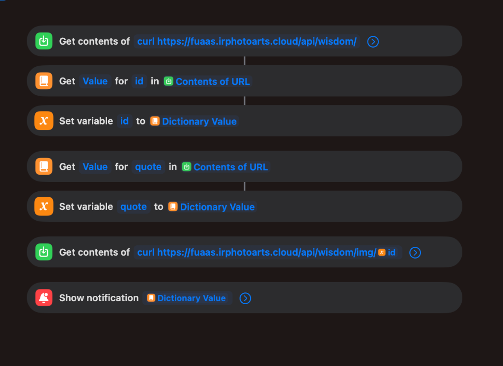

# FUaaS - Fufufafa as a Service

<p align="center">
  
</p>


As humans, mistakes are inevitable. What separates good outcomes from costly ones is access to the right wisdom at the right time.

From career decisions and leadership challenges to personal growth and relationships, wisdom plays a critical role. Yet in moments of pressure or uncertainty, reliable guidance is often difficult to access.

This API delivers curated wisdom from the legendary Fufufafa, a cultural icon whose insights have resonated with millions. These timeless reflections are transformed into a structured, modern API that businesses can seamlessly integrate into their products, platforms, or services.

By integrating this API, meaningful and relatable wisdom can be delivered at scale, whether used by individuals or by enterprises.

[](https://github.com/fufufufafafa/fufufafa-memorable-quotes)


## Live API

**Base URL:** `https://fuaas.irphotoarts.cloud`

### Quick Start

```bash
# Get random quote
curl https://fuaas.irphotoarts.cloud/api/wisdom/

# Get specific quote
curl https://fuaas.irphotoarts.cloud/api/wisdom/47

# Get quote image
curl https://fuaas.irphotoarts.cloud/api/wisdom/img/47 --output quote.png
```

## API Endpoints

| Endpoint | Description |
|----------|-------------|
| `GET /api/wisdom/` | Random quote |
| `GET /api/wisdom/:id` | Quote by ID |
| `GET /api/wisdom/img` | Random image |
| `GET /api/wisdom/img/:id` | Image by ID |
| `GET /health` | Health check |

See [API.md](./API.md) for full documentation.

## Integrations

### Siri Shortcut

Get daily wisdom notifications on your iPhone with our ready-to-use Siri Shortcut:

[](https://www.icloud.com/shortcuts/b62ce426cadc42d8b1f9f11b10cf604d)

<p align="center">
  
</p>

## Self-Hosting Guide

### Prerequisites

- [Node.js](https://nodejs.org/) (v18+)
- [Wrangler CLI](https://developers.cloudflare.com/workers/wrangler/install-and-update/) (`npm install -g wrangler`)
- Cloudflare account with Workers, D1, and R2 access

### 1. Clone the Repository

```bash
git clone --recurse-submodules https://github.com/your-username/FUaaS.git
cd FUaaS
```

### 2. Create Cloudflare Resources

```bash
# Login to Cloudflare
wrangler login

# Create D1 database
wrangler d1 create fuaas-quotes

# Create R2 bucket
wrangler r2 bucket create fuaas-images
```

Update `backend/wrangler.toml` with your D1 database ID.

### 3. Prepare Data

```bash
# Generate quotes JSON from raw data
cd data-extraction
npm install
node generate-json.js

# Generate database seed file
cd ../backend
node generate-seed.js
```

### 4. Seed Database & Upload Images

```bash
cd backend

# Initialize D1 database
wrangler d1 execute fuaas-quotes --remote --file=schema.sql
wrangler d1 execute fuaas-quotes --remote --file=seed.sql

# Upload images to R2
chmod +x scripts/upload-images.sh
./scripts/upload-images.sh
```

### 5. Deploy

```bash
cd backend
wrangler deploy
```

### Local Development

```bash
cd backend

# Seed local D1 database
wrangler d1 execute fuaas-quotes --local --file=schema.sql
wrangler d1 execute fuaas-quotes --local --file=seed.sql

# Start local dev server
wrangler dev --local
```

For detailed technical context, see [AGENT.md](./AGENT.md).


This is a satire/archive project. Quotes are preserved for historical and entertainment purposes.

## License

MIT

## Acknowledgment
The inspiration for this project is derived from the open source work titled “No as a Service”, available at the following public repository:

[](https://github.com/hotheadhacker/no-as-a-service)

This acknowledgment is provided solely to credit conceptual inspiration and does not imply any affiliation, endorsement, or association with the referenced project or its contributors.

## Legal Notice
All content made available through this service is derived from publicly accessible sources that are openly available online. This project does not assert ownership, copyright, or exclusive rights over the original materials. The content is reproduced and distributed in good faith for archival, informational, research, and entertainment purposes.

This service is not affiliated with, endorsed by, or sponsored by any individual, entity, or platform associated with the original source of the content. If any rights holder believes that the use of certain material is inappropriate, they are encouraged to raise the matter through the project repository for review and, if necessary, remediation.
